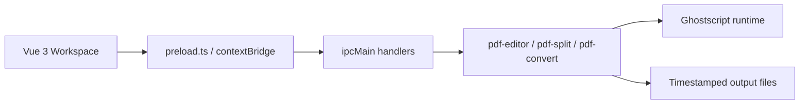

<div align="center">
  
  <h1>PDF Squeezer</h1>
  <p>A desktop PDF workspace that brings compression, merge, split and format conversion into one focused UI.</p>
  <p>
    <a href="./README.md">简体中文</a>
    <span>&nbsp;|&nbsp;</span>
    <strong>English</strong>
  </p>
  <p>
    
    
    
    
  </p>
</div>

<p align="center">
  
</p>

<p align="center">
  <a href="#overview-en">Overview</a>
  <span>&nbsp;|&nbsp;</span>
  <a href="#features-en">Features</a>
  <span>&nbsp;|&nbsp;</span>
  <a href="#quick-start-en">Quick Start</a>
  <span>&nbsp;|&nbsp;</span>
  <a href="#packaging-en">Packaging</a>
  <span>&nbsp;|&nbsp;</span>
  <a href="#structure-en">Project Structure</a>
</p>

<a id="overview-en"></a>

## Overview

> PDF Squeezer is a local-first desktop utility focused on practical PDF workflows.
>
> It combines four common jobs into one workspace: PDF compression, PDF merge, PDF split and PDF-to-image conversion, powered by Electron, Vue 3 and Ghostscript.

### Best for

- Office users who need to shrink PDF files before email delivery, uploads or archiving.
- Users who want to merge multiple PDFs and control the final order with drag-and-drop.
- Users who need both split modes: every N pages, or custom extraction such as `1-3,5-6`.
- Teams or individuals who want to export PDF pages as PNG / JPEG images locally and offline.

<a id="stack-en"></a>

## Tech Stack

<p>
  
  
  
  
  
  
  
  
</p>

<a id="features-en"></a>

## Features

<table>
  <tr>
    <td width="50%" valign="top">
      <h3>Compression</h3>
      <p>Includes five Ghostscript presets: <code>screen</code>, <code>ebook</code>, <code>printer</code>, <code>prepress</code> and <code>default</code>.</p>
      <p>Batch upload and batch processing are supported, and original files stay untouched.</p>
    </td>
    <td width="50%" valign="top">
      <h3>Merge</h3>
      <p>Add multiple PDFs and merge them in the exact order shown in the file drawer.</p>
      <p>The drawer supports drag sorting, removing items and clearing the queue.</p>
    </td>
  </tr>
  <tr>
    <td width="50%" valign="top">
      <h3>Split</h3>
      <p>The app reads total page count first, then offers two split modes.</p>
      <p><strong>Interval split:</strong> create one file every N pages.</p>
      <p><strong>Custom extract:</strong> enter <code>1-3,5-6</code> to extract pages 1, 2, 3, 5 and 6 into a new PDF.</p>
    </td>
    <td width="50%" valign="top">
      <h3>Convert</h3>
      <p>Currently supports PDF-to-image conversion with <code>PNG</code> and <code>JPEG</code> output.</p>
      <p>Every source PDF gets its own output folder, with 150 / 200 / 300 DPI options.</p>
    </td>
  </tr>
  <tr>
    <td width="50%" valign="top">
      <h3>Unified File Drawer</h3>
      <p>The right-side drawer shows file count, total size and current ordering for the active tool.</p>
      <p>It can be collapsed, reordered and managed without leaving the workspace.</p>
    </td>
    <td width="50%" valign="top">
      <h3>Safe Output Flow</h3>
      <p>All results are written to the output directory selected by the user and remembered locally.</p>
      <p>Temporary files are cleaned up after processing and source PDFs are never overwritten directly.</p>
    </td>
  </tr>
</table>

## Architecture Flow



## Highlights

- Single-workspace design for four PDF tasks in one window.
- Drag-aware file drawer that stays in sync with the active tool.
- Auto page count detection before split, reducing invalid user input.
- Bundled Ghostscript runtime with support for Electron packaging using `asar: true`.
- Fully local processing, suitable for offline and privacy-sensitive workflows.

<a id="quick-start-en"></a>

## Quick Start

### Requirements

- Windows 10 / 11 x64
- Node.js `^20.19.0 || >=22.12.0`
- Yarn 1.x or Yarn via Corepack

### Install

```bash
git clone <your-repository-url>
cd pdf-squeezer
corepack enable
yarn install
```

### Run in Development

```bash
yarn dev
```

### Build for Production

```bash
yarn build
```

### Common Commands

| Command | Description |
| --- | --- |
| `yarn dev` | Start Vite + Electron in development mode |
| `yarn vue:build` | Build frontend assets only |
| `yarn build` | Build frontend and package the Electron app |
| `yarn vue-tsc --noEmit -p tsconfig.app.json` | Run frontend type checks |

## Usage

1. Open the app and choose an output directory from the top-right settings panel.
2. Pick the tool you need: compress, merge, split or convert.
3. Click to upload or drag PDF files into the workspace.
4. For merge jobs, reorder files in the right drawer before starting.
5. Configure the needed options and run the task. Results are written into the selected output directory.

## Split Examples

| Input mode | Example | Result |
| --- | --- | --- |
| Interval split | `Every 3 pages` | Splits as `1-3`, `4-6`, `7-9` and so on |
| Custom extract | `1-3,5-6` | Extracts pages 1, 2, 3, 5 and 6 into one new PDF |
| Single pages | `2,4,8` | Extracts only pages 2, 4 and 8 |

## Output Behavior

- Compression outputs a new timestamped file based on the source name.
- Merge outputs `merged-<timestamp>.pdf` by default.
- Split outputs either multiple `part` files or one custom page-range file.
- PDF-to-image conversion creates one folder per source PDF and exports ordered images inside it.

<a id="packaging-en"></a>

## Packaging

The repository already bundles a Windows Ghostscript runtime under `core/`.

To support Electron builds with `asar: true`, the project uses the following strategy:

- `core/` is copied into `resources/core/` through `extraResources`.
- A shared Ghostscript runtime resolver switches paths automatically between development and packaged builds.
- Runtime dependencies such as `lib`, `Resource` and `iccprofiles` are injected through environment variables.

That means you do not need a global Ghostscript installation, and packaged builds do not require extra manual copying.

<a id="structure-en"></a>

## Project Structure

```text
pdf-squeezer/
|- core/                         # Ghostscript Windows runtime
|- docs/                         # README visual assets
|- electron/
|  |- main.ts                    # Main process and IPC handlers
|  |- preload.ts                 # contextBridge API
|  |- icon.ico
|  |- icon.png
|  \- util/
|     |- ghostscript-runtime.ts  # Runtime path and env resolution
|     |- pdf-editor.ts           # Compression and merge logic
|     |- pdf-split.ts            # Page count and split logic
|     \- pdf-convert.ts         # PDF to image conversion
|- src/
|  |- App.vue
|  |- main.ts
|  |- router/
|  |  \- index.ts
|  \- views/
|     |- PdfWorkspace.vue        # Main workspace
|     \- components/
|        |- CompressView.vue
|        |- MergeView.vue
|        |- SplitView.vue
|        |- ConvertView.vue
|        |- PdfFileList.vue
|        \- dialog/
|           \- SystemSettingDialog.vue
|- public/
|- package.json
|- vite.config.ts
\- README.md
```

## Roadmap

- [x] PDF compression
- [x] PDF merge
- [x] PDF split
- [x] PDF to image
- [ ] Image to PDF
- [ ] More export naming options and batch controls
- [ ] Cross-platform Ghostscript runtime support

## Acknowledgements

- [Electron](https://www.electronjs.org/)
- [Vue 3](https://vuejs.org/)
- [Ghostscript](https://ghostscript.com/)
- [Element Plus](https://element-plus.org/)

## License

Released under the [MIT](./LICENSE) License.