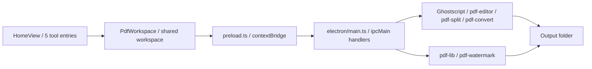

<div align="center">
  
  <h1>PDF Squeezer</h1>
  <p>A local-first desktop app for streamlined PDF workflows.</p>
  <p>
    <a href="./README.md">简体中文</a>
    <span>&nbsp;|&nbsp;</span>
    <strong>English</strong>
  </p>
  <p>
    
    
    
    
  </p>
  <p>
    
    
    
    
    
    
    
    
  </p>
  <p>
    
    
    
    
  </p>
</div>

<p align="center">
  
</p>

<p align="center">
  <a href="#overview-en">Overview</a>
  <span>&nbsp;|&nbsp;</span>
  <a href="#features-en">Feature Matrix</a>
  <span>&nbsp;|&nbsp;</span>
  <a href="#workflow-en">Workflow</a>
  <span>&nbsp;|&nbsp;</span>
  <a href="#quick-start-en">Quick Start</a>
  <span>&nbsp;|&nbsp;</span>
  <a href="#packaging-en">Packaging</a>
  <span>&nbsp;|&nbsp;</span>
  <a href="#structure-en">Project Structure</a>
</p>

<a id="overview-en"></a>

## Overview

> PDF Squeezer is a Windows-focused local desktop utility for practical PDF work. The goal is simple: keep the common PDF jobs inside one app instead of spreading them across websites, scripts and separate tools.

The current build ships with 5 core tools:

- `compress`: PDF compression with 5 Ghostscript presets.
- `merge`: merge multiple PDFs with drag-and-drop ordering.
- `split`: split evenly by page count or extract custom ranges such as `1-3,5-6`.
- `convert`: export PDF pages to `PNG` / `JPEG` with 150 / 200 / 300 DPI options.
- `watermark`: batch-apply text or image watermarks with opacity, scale, rotation and layout controls.

The UI structure is now centered around three stable layers:

- `src/views/HomeView.vue` provides the home screen with 5 tool cards.
- `src/views/PdfWorkspace.vue` hosts the shared workspace, output settings and file drawer.
- `src/App.vue` provides the custom title bar for the frameless window, including minimize and close buttons.

<a id="features-en"></a>

## Feature Matrix

| Tool | Current capabilities | Notes |
| --- | --- | --- |
| Compression | `screen`, `ebook`, `printer`, `prepress`, `default` | Batch compression, source files preserved, timestamped outputs |
| Merge | Multi-PDF merge with drag sorting | Uses the right-side drawer order to produce one merged result |
| Split | Interval split plus custom page extraction | Reads total page count first, then runs even split or `1-3,5-6` extraction |
| Convert | PDF to image | Supports `PNG` / `JPEG`, one output folder per source PDF |
| Watermark | Text/image watermark with live mock preview | Adjustable opacity, size, rotation, tile gap and center/tile layout |

### Shared UX

- Unified file drawer: all tools reuse the same right-side list with collapse, reorder, remove and clear actions.
- Persistent output folder: the selected output directory is remembered locally.
- Local processing: Ghostscript powers compression, split and conversion; `pdf-lib` handles watermark rendering.
- Custom window chrome: the Electron window uses `frame: false` and `titleBarStyle: "hidden"` with a custom draggable title bar.

<a id="workflow-en"></a>

## Workflow



### Current UI highlights

- Users start on the home screen, choose a tool, then move into a focused workspace.
- Split mode reads total page count before execution, which cuts down invalid input.
- Watermark mode includes a simulated preview panel so the user can inspect the approximate result before writing the final PDF.
- Output settings are shared across all tools, so the user configures the folder once and keeps moving.

<a id="quick-start-en"></a>

## Quick Start

### Requirements

- Windows 10 / 11 x64
- Node.js `^20.19.0 || >=22.12.0`
- Yarn 1.x, or Yarn via Corepack

### Install

```bash
git clone <your-repository-url>
cd pdf-squeezer
corepack enable
yarn install
```

### Run in Development

```bash
yarn dev
```

### Build the Installer

```bash
yarn build
```

### Common Commands

| Command | Description |
| --- | --- |
| `yarn dev` | Start Vite and Electron in development |
| `yarn vue:dev` | Start the frontend dev server only |
| `yarn vue:build` | Build frontend assets only |
| `yarn build` | Build frontend assets, then run `electron-builder` |
| `yarn vue-tsc --noEmit -p tsconfig.app.json` | Run frontend type checks |

## Usage

1. Start the app and choose an output directory from the top-right settings panel.
2. Return to the home screen and select the tool you need.
3. Upload PDFs or drag them into the workspace.
4. For merge jobs, reorder the files in the right-side drawer; for split jobs, only one PDF is processed at a time.
5. For watermark jobs, adjust text or image settings and confirm the approximate result in the mock preview panel.
6. Run the task. Outputs are written into the configured directory and source PDFs stay untouched.

### Split Examples

| Input mode | Example | Result |
| --- | --- | --- |
| Interval split | Every `3` pages | Outputs `1-3`, `4-6`, `7-9` and so on |
| Custom extract | `1-3,5-6` | Extracts pages 1, 2, 3, 5 and 6 into one new PDF |
| Custom single pages | `2,4,8` | Extracts only pages 2, 4 and 8 into one new PDF |

### Watermark Capabilities

| Item | Current support |
| --- | --- |
| Content | Text watermark, image watermark |
| Layout | Center, tile |
| Controls | Opacity, size, rotation, tile gap |
| Preview | Simulated single-page preview with live updates |
| Output | Batch-generated `*-watermark-<timestamp>-<index>.pdf` files |

<a id="packaging-en"></a>

## Packaging

The project already handles the Ghostscript runtime for Electron packaging. The key points are:

- `build.asar` is enabled in `package.json`.
- `dist/` is copied into `resources/vue/` through `extraResources`.
- `core/` is copied into `resources/core/` through `extraResources` so the bundled Ghostscript runtime remains accessible after packaging.
- `electron/util/ghostscript-runtime.ts` switches paths between development and packaged builds and wires up the required environment variables.

That means:

- Development uses the repository-local `core/`.
- Packaged builds use `resources/core/`.
- Users do not need a separate system Ghostscript installation.

The current packaging target is Windows `nsis`, with build output written to `electron-dist/`.

<a id="structure-en"></a>

## Project Structure

```text
pdf-squeezer/
|- assets/                      # electron-builder resources
|- core/                        # Ghostscript Windows runtime
|- docs/
|  \- readme-cover.svg          # README cover artwork
|- electron/
|  |- main.ts                   # Main process and IPC handlers
|  |- preload.ts                # contextBridge API exposure
|  |- icon.ico
|  |- icon.png
|  \- util/
|     |- ghostscript-runtime.ts # Ghostscript path and env resolution
|     |- pdf-convert.ts         # PDF to image conversion
|     |- pdf-editor.ts          # Compression and merge logic
|     |- pdf-split.ts           # Page counting and split logic
|     \- pdf-watermark.ts       # Watermark processing
|- public/
|- src/
|  |- App.vue                   # Custom title bar and window controls
|  |- main.ts
|  |- router/
|  |  \- index.ts               # Home route + dynamic tool routes
|  \- views/
|     |- HomeView.vue           # Home screen
|     |- PdfWorkspace.vue       # Shared workspace shell
|     |- tool-config.ts         # Metadata for all 5 tools
|     \- components/
|        |- CompressView.vue
|        |- ConvertView.vue
|        |- MergeView.vue
|        |- PdfFileList.vue
|        |- SplitView.vue
|        |- WatermarkView.vue
|        \- dialog/
|           \- SystemSettingDialog.vue
|- package.json
|- README.md
\- README.en.md
```

## Roadmap

- [x] PDF compression
- [x] PDF merge
- [x] PDF split
- [x] PDF to image
- [x] PDF watermark
- [ ] Image to PDF
- [ ] More output naming rules and batch options
- [ ] More watermark presets and positioning controls
- [ ] Cross-platform runtime support

## Acknowledgements

- [Electron](https://www.electronjs.org/)
- [Vue 3](https://vuejs.org/)
- [Ghostscript](https://ghostscript.com/)
- [pdf-lib](https://pdf-lib.js.org/)
- [Element Plus](https://element-plus.org/)

## License

Released under the [MIT](./LICENSE) License.
