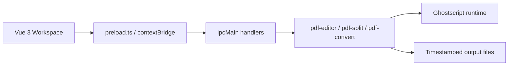

<div align="center">
  
  <h1>PDF Squeezer</h1>
  <p>一个桌面端 PDF 工作台，把压缩、合并、拆分与格式转换放进同一个流畅界面。</p>
  <p>
    <strong>简体中文</strong>
    <span>&nbsp;|&nbsp;</span>
    <a href="./README.en.md">English</a>
  </p>
  <p>
    
    
    
    
  </p>
</div>

<p align="center">
  
</p>

<p align="center">
  <a href="#overview-cn">项目简介</a>
  <span>&nbsp;|&nbsp;</span>
  <a href="#features-cn">功能概览</a>
  <span>&nbsp;|&nbsp;</span>
  <a href="#quick-start-cn">快速开始</a>
  <span>&nbsp;|&nbsp;</span>
  <a href="#packaging-cn">打包说明</a>
  <span>&nbsp;|&nbsp;</span>
  <a href="#structure-cn">项目结构</a>
</p>

<a id="overview-cn"></a>

## 项目简介

> PDF Squeezer 是一个面向本地桌面的 PDF 处理工具，聚焦于“开箱即用、离线处理、统一工作流”。
>
> 当前版本已经把 PDF 压缩、合并、拆分、PDF 转图片 四类高频操作整合到同一工作台里，并通过 Electron + Vue 3 + Ghostscript 提供稳定的本地处理体验。

### 适合谁

- 需要快速压缩 PDF 以便邮件发送、系统上传或归档整理的办公用户。
- 需要按顺序合并多个 PDF，或通过拖拽调整合并顺序的日常使用场景。
- 需要按“每 N 页一个文件”拆分，或通过 `1-3,5-6` 这类范围提取指定页面的用户。
- 需要把 PDF 批量导出为 PNG / JPEG 图片的设计、运营或资料整理场景。

<a id="stack-cn"></a>

## 技术栈

<p>
  
  
  
  
  
  
  
  
</p>

<a id="features-cn"></a>

## 功能概览

<table>
  <tr>
    <td width="50%" valign="top">
      <h3>压缩</h3>
      <p>内置 5 档 Ghostscript 压缩预设：<code>screen</code>、<code>ebook</code>、<code>printer</code>、<code>prepress</code>、<code>default</code>。</p>
      <p>支持批量上传与批量处理，原文件不会被覆盖，输出文件自动追加时间戳。</p>
    </td>
    <td width="50%" valign="top">
      <h3>合并</h3>
      <p>支持一次加入多个 PDF，并按右侧文件列表的顺序进行合并。</p>
      <p>文件抽屉支持拖拽排序、移除、清空，适合合同附件、扫描件和资料汇总场景。</p>
    </td>
  </tr>
  <tr>
    <td width="50%" valign="top">
      <h3>拆分</h3>
      <p>上传后会先自动读取 PDF 总页数，再提供两种拆分方式：</p>
      <p><strong>平均拆分：</strong>例如每 3 页输出一个新文档。</p>
      <p><strong>自定义提取：</strong>例如输入 <code>1-3,5-6</code>，会提取 1、2、3、5、6 页并生成新的 PDF。</p>
    </td>
    <td width="50%" valign="top">
      <h3>格式转换</h3>
      <p>当前支持 PDF 转图片，可导出 <code>PNG</code> / <code>JPEG</code>，并提供 150 / 200 / 300 DPI 选项。</p>
      <p>每个源 PDF 会生成独立输出文件夹，方便查看、分类和归档。</p>
    </td>
  </tr>
  <tr>
    <td width="50%" valign="top">
      <h3>统一文件抽屉</h3>
      <p>右侧文件区会显示当前工具对应的文件队列、总大小与排序状态。</p>
      <p>支持展开 / 收起、拖拽调整顺序、单项删除与整列清空。</p>
    </td>
    <td width="50%" valign="top">
      <h3>输出与安全性</h3>
      <p>所有处理结果统一输出到用户选择的目录，路径通过本地存储记住。</p>
      <p>处理过程会使用临时文件，完成后清理，原始 PDF 不会被直接覆盖。</p>
    </td>
  </tr>
</table>

## 架构流程



## 亮点设计

- 单窗口工作台设计，把四类 PDF 任务集中到一个页面里完成。
- 文件侧栏与工具页联动，不需要反复切换页面或弹出多个窗口。
- 拆分前自动读取页数，降低用户误填参数的概率。
- 打包时 Ghostscript 作为外部资源携带，支持 `asar: true` 的 Electron 构建方式。
- 本地离线处理，不依赖在线服务，适合敏感资料和内网使用场景。

<a id="quick-start-cn"></a>

## 快速开始

### 环境要求

- Windows 10 / 11 x64
- Node.js `^20.19.0 || >=22.12.0`
- Yarn 1.x 或通过 Corepack 使用 Yarn

### 安装依赖

```bash
git clone <your-repository-url>
cd pdf-squeezer
corepack enable
yarn install
```

### 启动开发环境

```bash
yarn dev
```

### 生产构建

```bash
yarn build
```

### 常用命令

| 命令 | 说明 |
| --- | --- |
| `yarn dev` | 启动 Vite + Electron 开发环境 |
| `yarn vue:build` | 仅构建前端资源 |
| `yarn build` | 构建前端并执行 `electron-builder` 打包 |
| `yarn vue-tsc --noEmit -p tsconfig.app.json` | 执行前端类型检查 |

## 使用说明

1. 首次打开应用后，先在右上角进入“输出设置”，选择结果保存目录。
2. 在顶部标签页中选择要使用的工具：压缩、合并、拆分或格式转换。
3. 点击上传或直接拖入 PDF 文件；合并和压缩支持多文件，拆分一次仅处理一个 PDF。
4. 如果是合并任务，可在右侧文件抽屉中拖拽调整顺序。
5. 设置参数后执行处理，结果会输出到已配置的目录中。

## 拆分规则示例

| 输入方式 | 示例 | 输出行为 |
| --- | --- | --- |
| 平均拆分 | `每 3 页一个文件` | 按 `1-3`、`4-6`、`7-9`... 连续拆分 |
| 自定义提取 | `1-3,5-6` | 提取 1、2、3、5、6 页并合成为一个新的 PDF |
| 自定义单页 | `2,4,8` | 只提取第 2、4、8 页并生成新的 PDF |

## 输出行为

- 压缩结果会按原文件名生成新的时间戳文件。
- 合并结果默认输出为 `merged-时间戳.pdf`。
- 拆分结果会根据模式生成 `part` 文件，或按页码组合命名的新文件。
- PDF 转图片会为每个源文件创建独立文件夹，并输出顺序编号的图片。

<a id="packaging-cn"></a>

## 打包说明

当前项目内置了 Windows 版 Ghostscript 运行时，位于仓库中的 `core/` 目录。

为兼容 Electron 打包时的 `asar: true`，项目采用了下面这套策略：

- 打包时通过 `extraResources` 把 `core/` 复制到 `resources/core/`。
- 运行时通过统一的 Ghostscript 路径解析模块，在开发环境和生产环境间自动切换。
- Ghostscript 的 `lib`、`Resource`、`iccprofiles` 路径通过环境变量一并注入，避免运行时找不到依赖资源。

这意味着你不需要额外安装系统级 Ghostscript，也不需要在打包后手动复制依赖。

<a id="structure-cn"></a>

## 项目结构

```text
pdf-squeezer/
|- core/                         # Ghostscript Windows runtime
|- docs/                         # README 视觉素材
|- electron/
|  |- main.ts                    # Electron 主进程与 IPC 注册
|  |- preload.ts                 # contextBridge API 暴露
|  |- icon.ico
|  |- icon.png
|  \- util/
|     |- ghostscript-runtime.ts  # 运行时路径与环境变量解析
|     |- pdf-editor.ts           # PDF 压缩与合并
|     |- pdf-split.ts            # PDF 页数读取与拆分
|     \- pdf-convert.ts         # PDF 转图片
|- src/
|  |- App.vue
|  |- main.ts
|  |- router/
|  |  \- index.ts
|  \- views/
|     |- PdfWorkspace.vue        # 主工作台
|     \- components/
|        |- CompressView.vue
|        |- MergeView.vue
|        |- SplitView.vue
|        |- ConvertView.vue
|        |- PdfFileList.vue
|        \- dialog/
|           \- SystemSettingDialog.vue
|- public/
|- package.json
|- vite.config.ts
\- README.en.md
```

## Roadmap

- [x] PDF 压缩
- [x] PDF 合并
- [x] PDF 拆分
- [x] PDF 转图片
- [ ] 图片转 PDF
- [ ] 更多导出命名规则与批处理选项
- [ ] 跨平台 Ghostscript runtime 适配

## 致谢

- [Electron](https://www.electronjs.org/)
- [Vue 3](https://vuejs.org/)
- [Ghostscript](https://ghostscript.com/)
- [Element Plus](https://element-plus.org/)

## License

本项目基于 [MIT](./LICENSE) 协议开源。