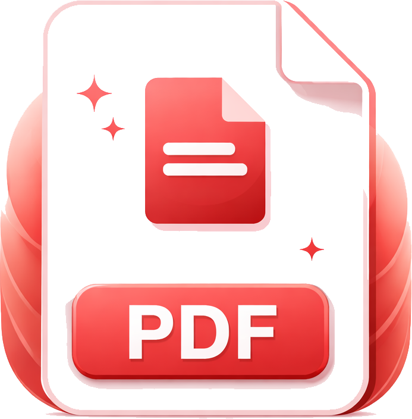
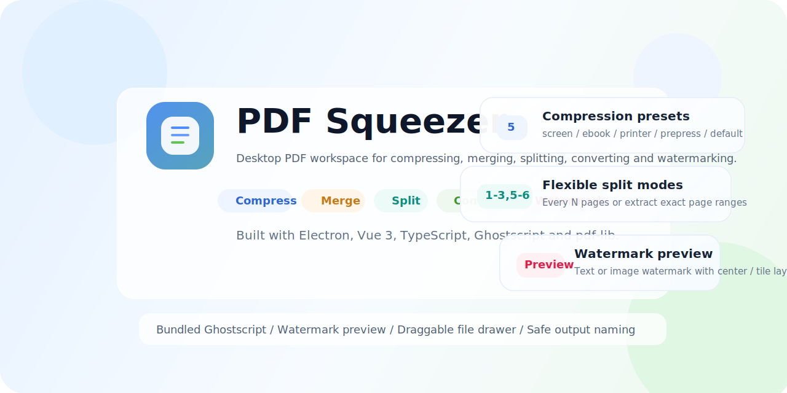
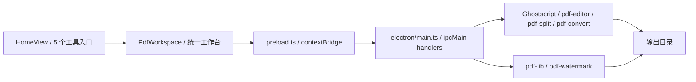

<div align="center">
  
  <h1>PDF Squeezer</h1>
  <p>一个本地优先、专注高效 PDF 工作流的桌面应用</p>
  <p>
    <strong>简体中文</strong>
    <span>&nbsp;|&nbsp;</span>
    <a href="./README.en.md">English</a>
  </p>
  <p>
    
    
    
    
  </p>
  <p>
    
    
    
    
    
    
    
    
  </p>
  <p>
    
    
    
    
  </p>
</div>

<p align="center">
  
</p>

<p align="center">
  <a href="#overview-cn">项目简介</a>
  <span>&nbsp;|&nbsp;</span>
  <a href="#features-cn">功能矩阵</a>
  <span>&nbsp;|&nbsp;</span>
  <a href="#workflow-cn">工作流</a>
  <span>&nbsp;|&nbsp;</span>
  <a href="#quick-start-cn">快速开始</a>
  <span>&nbsp;|&nbsp;</span>
  <a href="#packaging-cn">打包说明</a>
  <span>&nbsp;|&nbsp;</span>
  <a href="#structure-cn">项目结构</a>
</p>

<a id="overview-cn"></a>

## 项目简介

> PDF Squeezer 是一个面向 Windows 的本地桌面 PDF 工具，目标很直接：把高频 PDF 操作集中到一个界面里，减少来回切换工具、网页和脚本的成本。

当前版本已经覆盖 5 个核心工具：

- `compress`：PDF 压缩，内置 5 档 Ghostscript 预设。
- `merge`：多文件合并，支持拖拽排序。
- `split`：按固定页数平均拆分，或通过 `1-3,5-6` 这类范围提取页面。
- `convert`：将 PDF 导出为 `PNG` / `JPEG` 图片，可选 150 / 200 / 300 DPI。
- `watermark`：批量添加文字或图片水印，支持透明度、大小、旋转、居中和铺满。

项目的界面结构也已经稳定下来：

- 首页入口由 `src/views/HomeView.vue` 提供，显示 5 个功能卡片。
- 统一工作台由 `src/views/PdfWorkspace.vue` 承载，复用文件抽屉、输出目录和处理状态。
- 顶层窗口由 `src/App.vue` 提供自定义标题栏，当前是无边框窗口，带最小化和关闭按钮。

<a id="features-cn"></a>

## 功能矩阵

| 工具 | 当前能力 | 说明 |
| --- | --- | --- |
| 压缩 | `screen`、`ebook`、`printer`、`prepress`、`default` | 支持批量压缩，保留原文件，输出带时间戳的新文件 |
| 合并 | 多 PDF 合并 + 拖拽排序 | 按右侧文件抽屉顺序输出单个合并结果 |
| 拆分 | 平均拆分 + 自定义页码提取 | 先读取 PDF 总页数，再执行平均拆分或 `1-3,5-6` 提取 |
| 格式转换 | PDF 转图片 | 支持 `PNG` / `JPEG`，每个源 PDF 输出独立文件夹 |
| 水印 | 文字/图片水印 + 模拟预览 | 支持透明度、大小、旋转、铺满间距、居中/铺满布局，批量输出新 PDF |

### 共享体验

- 统一文件抽屉：不同工具共用右侧文件列表，支持收起、排序、删除和清空。
- 输出目录持久化：输出路径通过本地存储记住，下次打开仍可复用。
- 本地处理：压缩、拆分、转换依赖 Ghostscript；水印依赖 `pdf-lib`，全程离线完成。
- 自定义窗口：Electron 主窗口启用了 `frame: false` 和 `titleBarStyle: "hidden"`，界面使用自绘标题栏和拖拽区域。

<a id="workflow-cn"></a>

## 工作流



### 当前界面重点

- 首页先选工具，再进入对应工作台，流程比直接堆按钮更清楚。
- 拆分模式会先读取总页数，避免用户在不知道页数时盲填参数。
- 水印界面已经带模拟预览区，能先看到大致的应用效果，再真正写入 PDF。
- 所有工具都走同一套输出目录配置，不需要每个页面重复设置。

<a id="quick-start-cn"></a>

## 快速开始

### 环境要求

- Windows 10 / 11 x64
- Node.js `^20.19.0 || >=22.12.0`
- Yarn 1.x，或通过 Corepack 使用 Yarn

### 安装依赖

```bash
git clone <your-repository-url>
cd pdf-squeezer
corepack enable
yarn install
```

### 启动开发环境

```bash
yarn dev
```

### 构建安装包

```bash
yarn build
```

### 常用命令

| 命令 | 说明 |
| --- | --- |
| `yarn dev` | 启动 Vite 和 Electron 开发环境 |
| `yarn vue:dev` | 只启动前端开发服务器 |
| `yarn vue:build` | 只构建前端资源 |
| `yarn build` | 先构建前端，再执行 `electron-builder` |
| `yarn vue-tsc --noEmit -p tsconfig.app.json` | 执行前端类型检查 |

## 使用说明

1. 启动应用后，先在右上角进入“输出设置”，选择结果保存目录。
2. 回到首页，选择要使用的工具：压缩、合并、拆分、格式转换或水印。
3. 点击上传，或直接把 PDF 拖进对应工作台。
4. 如果是合并任务，在右侧文件抽屉里调整顺序；如果是拆分任务，当前一次只处理一个 PDF。
5. 如果是水印任务，在右侧设置区调整文字或图片参数，并通过模拟预览确认大致效果。
6. 执行处理后，结果会统一输出到已配置目录，不会直接覆盖原始 PDF。

### 拆分规则示例

| 输入方式 | 示例 | 输出行为 |
| --- | --- | --- |
| 平均拆分 | 每 `3` 页一个文档 | 连续输出 `1-3`、`4-6`、`7-9` ... |
| 自定义提取 | `1-3,5-6` | 提取 1、2、3、5、6 页并合成为一个新 PDF |
| 自定义单页 | `2,4,8` | 仅提取第 2、4、8 页并合成为一个新 PDF |

### 水印能力

| 项目 | 当前支持 |
| --- | --- |
| 水印内容 | 文字水印、图片水印 |
| 水印布局 | 居中、铺满 |
| 可调参数 | 透明度、大小、旋转角度、铺满间距 |
| 预览方式 | 模拟单页预览，实时反映当前设置 |
| 输出行为 | 批量生成新的 `*-watermark-时间戳-序号.pdf` 文件 |

<a id="packaging-cn"></a>

## 打包说明

当前项目已经按 Electron 打包场景处理好了 Ghostscript 运行时，重点是这几件事：

- `package.json` 中启用了 `build.asar: true`。
- `dist/` 会通过 `extraResources` 复制到 `resources/vue/`。
- `core/` 会通过 `extraResources` 复制到 `resources/core/`，用来携带 Ghostscript Windows 运行时。
- `electron/util/ghostscript-runtime.ts` 负责在开发环境和打包环境之间切换路径，并补齐运行所需环境变量。

这意味着：

- 开发时直接用仓库内的 `core/`。
- 打包后直接用安装目录下的 `resources/core/`。
- 不需要用户额外安装系统级 Ghostscript。

当前打包目标为 Windows `nsis`，输出目录为 `electron-dist/`。

<a id="structure-cn"></a>

## 项目结构

```text
pdf-squeezer/
|- assets/                      # electron-builder 资源目录
|- core/                        # Ghostscript Windows runtime
|- docs/
|  \- readme-cover.svg          # README 头图
|- electron/
|  |- main.ts                   # Electron 主进程与 IPC 注册
|  |- preload.ts                # contextBridge API 暴露
|  |- icon.ico
|  |- icon.png
|  \- util/
|     |- ghostscript-runtime.ts # Ghostscript 路径与环境变量解析
|     |- pdf-convert.ts         # PDF 转图片
|     |- pdf-editor.ts          # PDF 压缩与合并
|     |- pdf-split.ts           # PDF 页数读取与拆分
|     \- pdf-watermark.ts       # PDF 水印处理
|- public/
|- src/
|  |- App.vue                   # 自定义标题栏与窗口控制按钮
|  |- main.ts
|  |- router/
|  |  \- index.ts               # 首页 + 动态工具路由
|  \- views/
|     |- HomeView.vue           # 工具首页
|     |- PdfWorkspace.vue       # 统一工作台
|     |- tool-config.ts         # 5 个工具的配置元数据
|     \- components/
|        |- CompressView.vue
|        |- ConvertView.vue
|        |- MergeView.vue
|        |- PdfFileList.vue
|        |- SplitView.vue
|        |- WatermarkView.vue
|        \- dialog/
|           \- SystemSettingDialog.vue
|- package.json
|- README.en.md
\- README.md
```

## 路线图

- [x] PDF 压缩
- [x] PDF 合并
- [x] PDF 拆分
- [x] PDF 转图片
- [x] PDF 水印
- [ ] 图片转 PDF
- [ ] 更多输出命名规则和批处理选项
- [ ] 更多水印预设和定位能力
- [ ] 跨平台运行时支持

## 致谢

- [Electron](https://www.electronjs.org/)
- [Vue 3](https://vuejs.org/)
- [Ghostscript](https://ghostscript.com/)
- [pdf-lib](https://pdf-lib.js.org/)
- [Element Plus](https://element-plus.org/)

## 许可证

本项目基于 [MIT](./LICENSE) 协议开源。
